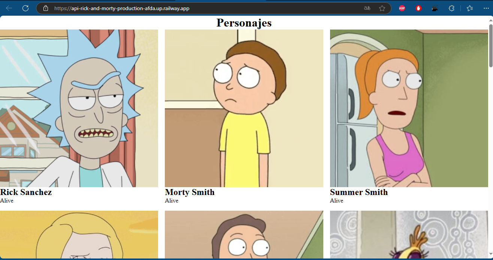

# Rick and Morty Character Viewer

This project is a simple JavaScript application that fetches and displays character data from the [Rick and Morty API](https://rickandmortyapi.com). 

## Overview

The application retrieves character details such as:
- Image
- Name
- Status

The data is dynamically displayed on the webpage for easy browsing. It utilizes JavaScript's `fetch` function to call the API at `https://rickandmortyapi.com/api/character`, processes the JSON response, and appends each character's information as an HTML article within the main section of the page.

## How It Works

1. The `getCharacters` function makes an API request to retrieve character data.
2. The response is processed, and each character's details are formatted into HTML.
3. Each character's information is added to the webpage, allowing users to browse characters from the *Rick and Morty* universe.

Enjoy exploring!
## Railway Deployment

The "Rick and Morty Character Viewer" is deployed on Railway. You can explore the live application using the link below.

### Live Website Link:

[Visit the project on Railway](https://api-rick-and-morty-production-afda.up.railway.app/)

> **Note**  
> - Access the live webpage to explore characters from the Rick and Morty universe.  
> - The page is fully functional and hosted on Railway for easy access.

## Results Railway

  

